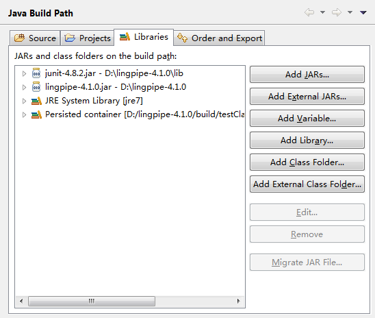

Eclipse
===
* Type Hierarchy Browsing
* issues
	* "Editor does not contain a main type"
		* right-click the src folder --> build path --> use as source folder
* Important Points
	* Build Project
	* Build Path --> Libraries --> JRE System Library
	* 

Java
===
* Issues
	* [Why do variable names often start with the letter 'm'?](http://stackoverflow.com/questions/4237469/why-do-variable-names-often-start-with-the-letter-m)
		* [Code Style Guidelines for Contributors](http://source.android.com/source/code-style.html#follow-field-naming-conventions)
		* Non-public, non-static field names start with m
		* Static field names start with s
		* Other fields start with a lower case letter
		* Public static final fields (constants) are ALL_CAPS_WITH_UNDERSCORES
* Key Points
	* [different kinds of variables](http://docs.oracle.com/javase/tutorial/java/nutsandbolts/variables.html)
		* Instance Variables (Non-static Fields)
			* individual states of objects are stored in "non-static fields". For example, the _currentSpeed_ of one bicycle is independent from the _currentSpeed_ of another.
		* Class Variables (Static Fields)
			* there is exactly one copy of this variable in existence, regardless of how many times the class has been instantiated. 
		* Local Variables
			* store temporary state
			* only visible to the methods in which they are declared, and not accessible from the rest of the class
		* Parameters
			*
			
			```java
			public static void main(String[] args)
			```
Demos
===
* Echo Demo

ClassifiyNews
===
* one language model per classifier
* language model classifiers
	* LanguageModel.Process -- DynamicLMClassifier
	* bounded character language models
	* tokenized language models

