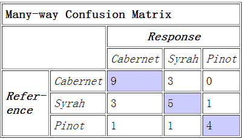
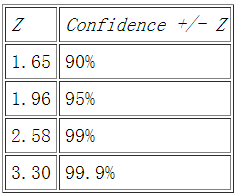

Confusion Matrix
===
* [Response & Refernce](http://alias-i.com/lingpipe/docs/api/com/aliasi/classify/ConfusionMatrix.html)
	* 
	* the value of the cell in the matrix for the specified reference and response category indices --> count (int referenceCategoryIndex, int responseCategoryIndex)
	* the total number of classifications, that is, just the sum of every cell in the matrix --> totalCount()
	* the total number of responses that matched the reference, that is, the sum of counts on the diagonal of the matrix --> totalCorrect()
	* totalAccuracy() = totalCorrect() / totalCount()
	* confidence95() 
	* 
		* the mapping in the above screenshot is calculated upon P(-z < Z < z) = gamma. Specifically, z could be 2.576, 1.96 or 1.645, gamma could be 0.99, 0.95, or 0.90, and the mapping is based on normal distribution.
		* z-score (also called z-values, z-scores, normal scores, and standardize variables, because the normal distribution is also known as "Z distribution")
			* positive: a datum is above the mean
			* negative: a datum is below the mean
			* z-score is often used in the z-test in standardized testing
