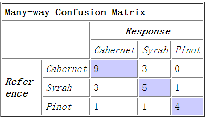
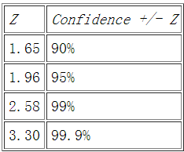

Confusion Matrix
===
* [Response & Refernce](http://alias-i.com/lingpipe/docs/api/com/aliasi/classify/ConfusionMatrix.html)
	* 
	* the value of the cell in the matrix for the specified reference and response category indices --> count (int referenceCategoryIndex, int responseCategoryIndex)
	* the total number of classifications, that is, just the sum of every cell in the matrix --> totalCount()
	* the total number of responses that matched the reference, that is, the sum of counts on the diagonal of the matrix --> totalCorrect()
	* totalAccuracy() = totalCorrect() / totalCount()
	* confidence95() 
		* 计算置信度为95%时的置信区间的关键在于计算出标准差theta
		* Say n=totalCount(), p=totalAccuracy(), q=1-p, then theta = sqrt(pq/n)
		* +/- confidence95() * theta
	* 
		* the mapping in the above screenshot is calculated upon P(-z < Z < z) = gamma. Specifically, z could be 2.576, 1.96 or 1.645, gamma could be 0.99, 0.95, or 0.90, and the mapping is based on standard normal distribution.
		* z-score (also called z-values, z-scores, normal scores, and standardize variables, because the normal distribution is also known as "Z distribution")
			* positive: a datum is above the mean
			* negative: a datum is below the mean
			* z-score is often used in the z-test in standardized testing
	* TP, FN, FP & TN
		* [True Positive VS True Negative](http://www.techexams.net/forums/security/49256-true-positive-v-s-true-negative.html)
		* [Class PrecisionRecallEvaluation](http://alias-i.com/lingpipe/docs/api/com/aliasi/classify/PrecisionRecallEvaluation.html)
		* Examples
			* [FN]An authorized user being rejected
			* [FP]An unauthorized user being given access
			* [TN]An unauthorized user being rejected
			* [TP]An authorized user being given access
* 评价分类器性能的指标
	* macro-precision
	* macro-recall
	* macro-FMeasure
	* fowlkesMallows()
	* jaccardCoefficient
	* yulesQ
	* yulesY
	* rejection precision
	* rejection recall
	* positive refernce
	* negative reference
	* positive response
	* negative response
	* reference likelihood
	* response likelihood
	* phiSquared
	* chiSquared
* output based on one testing file

```
Testing on profits.exceed.projection/test01.txt Got best category of: profits.exceed.projection
Rank  Category  Score  P(Category|Input)   log2 P(Category,Input)
0=profits.exceed.projection -4.526609711566235 0.9999999999994411 -203.69743702048058
1=non.finance -5.435410558070076 4.88726434803723E-13 -244.5934751131534
2=strategic.cooperation -5.497661824658843 7.011136093103314E-14 -247.39478210964793
```

TrainLM.java
===
RUN PARAMETERS
CORPUS NAME=unk
FILE EXTENSION=.txt

getExistingArgument
getArgumentLong
getArgument
getArgumentInt