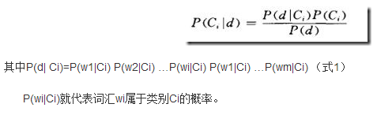

[文本分类](http://blog.csdn.net/luowen3405/article/details/6420526)
===
* 不同于网页分类
* 核心问题：用哪些特征表示一个文本才能保证__有效__和__快速__的分类（这两个需求往往是互相矛盾的）。
* 统计学习方法
	* 建立一个文档表示模型(representation)
	* 假设：文档的内容与其中包含的词有着必然的联系，同一类文档之间总存在多个共同的词，而不同类的文档所包含的词之间差异很大
	* 不仅仅是包含的词，还有这些词出现的次数对分类也很重要 --> 向量空间模型（Vector Space Modeling） --> 一篇文章被看作特征集合来看，利用加权特征项构成向量进行文本表示，利用词频信息对文本特征进行加权 --> VSM基本上完全忽略了除词的信息以外所有的部分，比如词之间顺序关系带来的信息以及上下文信息等，这使得它能表达的信息量存在__上限__ --> __基于Bag of words模型上的建模__ --> 有益的尝试，LSI（潜在语义索引）被实验证明保留了一定的语义信息
* 训练 -- 让计算机从给定的一堆文档（训练数据）中自己学习分类的规则
	* 预处理
		* 中文需要分词（词典法，HMM，CRF）
		* TF/IDF
		* 去除停止词（Stopwords）
		* 英文里还涉及stem
	* some issues
		* 高维性
		* 向量稀疏性
		* 过拟合 --> 特征集合过大
	* 如何选取最具代表性的特征 --> 对这个问题的解决，有人叫它__特征提取__，有人叫它__降维__
		* 特征选择(term selection) --> 从原有的特征（许多有用无用混在一起的词汇）中提取少量的、具有代表性的特征
		* 特征抽取(term extraction) --> 对原有的特征重构出新的特征（原来是一堆词，重构后变成了别的）
	* 基于训练数据的可信赖度，也有相应的措施应对
	* 基于训练数据的特点，来猜测一个可能的分类规则，也可以叫分类器，或者叫“假设”
	* Rocchio算法
		* 给每一个类别的文档设定一个质心向量，接着通过比较向量之间的距离来作为分类的准则
		* 两个假设
			* 一是，它认为一个类别的文档仅仅聚集在一个质心的周围（无法处理线性不可分的问题）
			* 二是，它假设训练数据是绝对正确，没有任何定量衡量样本是否含有噪声的机制
		* 常被用来比较不同算法优劣的Base line
	* Naive Bayes
		* 关注的是某文档属于某类别的概率
		* 这其中就蕴含了该算法最大的两个缺陷
			* 式(1)能够成立，就是假设一篇文章中的各个词之间是彼此独立的。但这显然不对，词语之间有明显的cooccurrence关系。不同主题的文章中，可能cooccurrence的次数或者频率有变化，但绝对谈不上独立
			* 使用某个词在某个类别训练文档中出现的次数来估计P(wi|Ci)时，只在训练数据足够多的情况下才比较准确
	* KNN
		* 在该算法看来，训练样本就代表了类别的准确信息（因此该算法也叫“基于实例”的分类器），而不管样本是使用什么特征表示的。
		* 没有真正意义上的“训练”阶段
		* 优点：
			* 很好地克服了Rocchio算法中无法处理线性不可分问题的缺陷
			* 也适用于分类标准随时会产生变化的需求（只要删除旧训练文档，添加新训练文档，就改变了分类的准则）
		* 最致命的缺点
			* 判断一个新文档的类别时，需要把它与现存的所有训练文档全都比较一遍，这个计算代价并不是每个系统能够承受的
		* 改良方法 --> Generalized Instance Set
	* SVM
		* 支持向量机方法是建立在统计学习理论的VC 维理论和结构风险最小原理基础上的，根据有限的样本信息在模型的复杂性（即对特定训练样本的学习精度，Accuracy）和学习能力（即无错误地识别任意样本的能力）之间寻求最佳折衷，以期获得最好的推广能力
		* 优势：
			* 解决小样本、非线性及高维模式识别，并能够应用到函数拟合等其它机器学习问题中
			* 通用性较好，且分类精度高、分类速度快，分类速度与训练样本个数无关
		* 缺点：
			* 核函数的选择缺乏指导，难以针对具体问题选择最佳的核函数
			* 训练速度极大受到训练集规模的影响，计算开销大，对此已经有了很多改进方法，包括Chunking 方法、Osuna 算法、SMO 算法和交互SVM 等等
* 相关概念
	* Term Space Reduction: 降维，或特征提取，包括特征选择和特征抽取两大类方法
	* Categorization Status Value: 用于描述将文档归于某个类别下有多大的可信度
	* 假设：计算机对训练集背后的真实模型（真实的分类规则）的猜测
	* 泛化性：一个假设能够正确分类训练集之外数据（即新的，未知的数据）的能力
	* 一致假设：一个假设能够对所有训练数据正确分类，则称这个假设是一致的
	* 过拟合：为了得到一致假设而使假设变得过度复杂
	* hyper plane: n维空间中的线性函数唯一确定了一个超平面。二维空间中，一条直线就是一个超平面；三维空间中，一个平面就是一个超平面
	* 线性可分和不可分：如果存在一个超平面能够正确分类训练数据，并且这个程序保证收敛，这种情况称为线形可分。如果这样的超平面不存在，则称数据是线性不可分的
	* Positive or Negative样本：对于某个类别来说，属于这个类别的样本文档称为正样本；反之，属于负样本
	
			

	
		
	
	
	